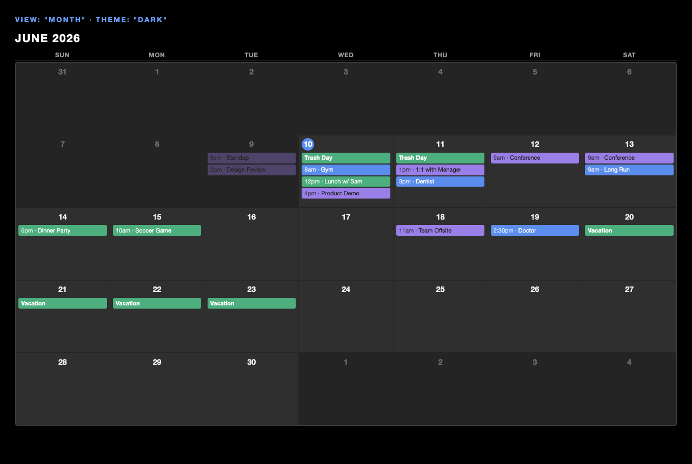
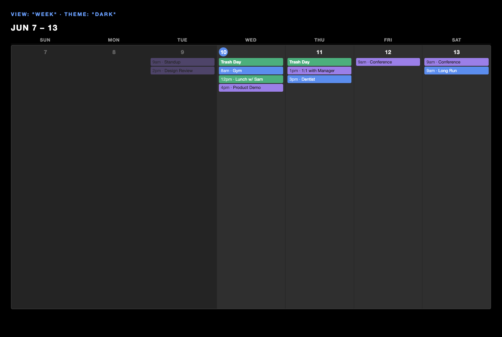
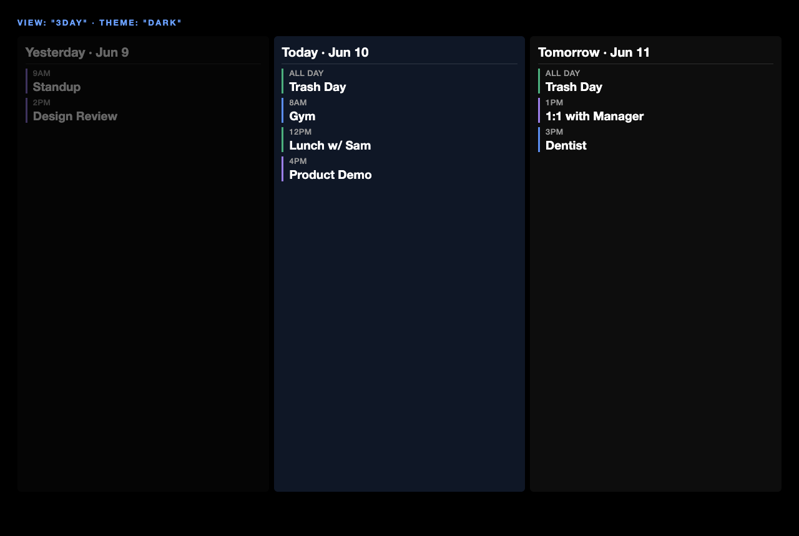
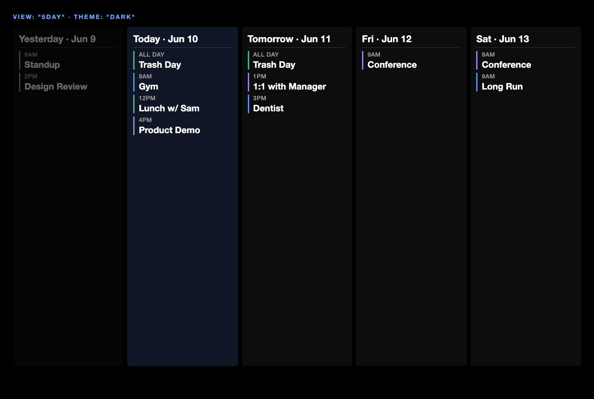
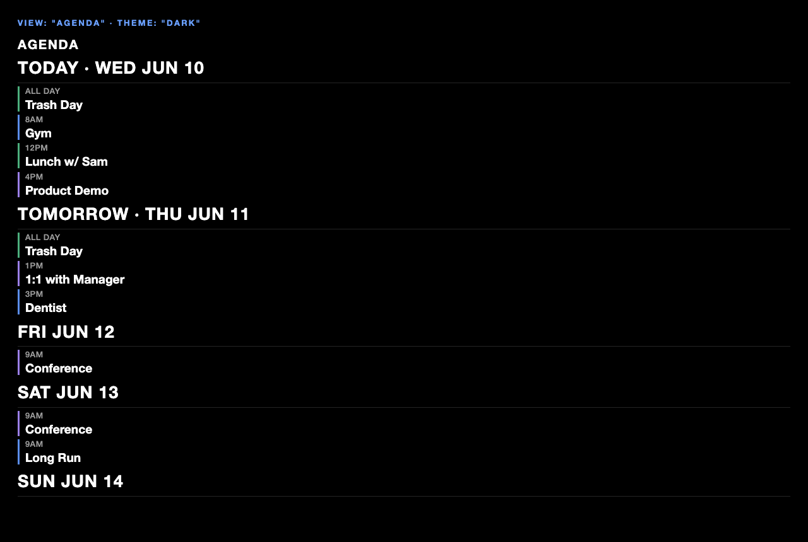
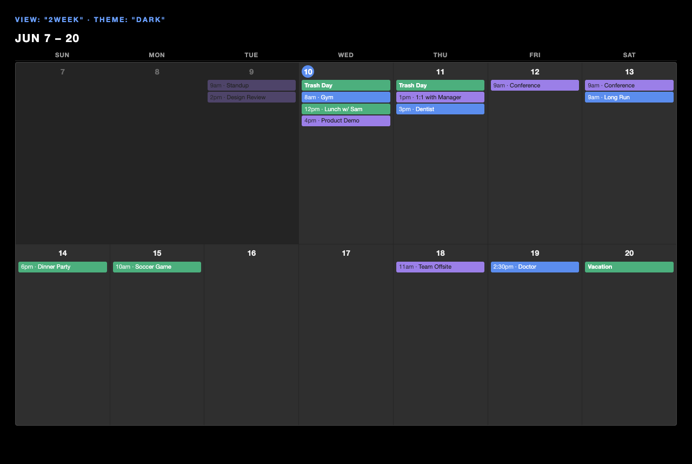
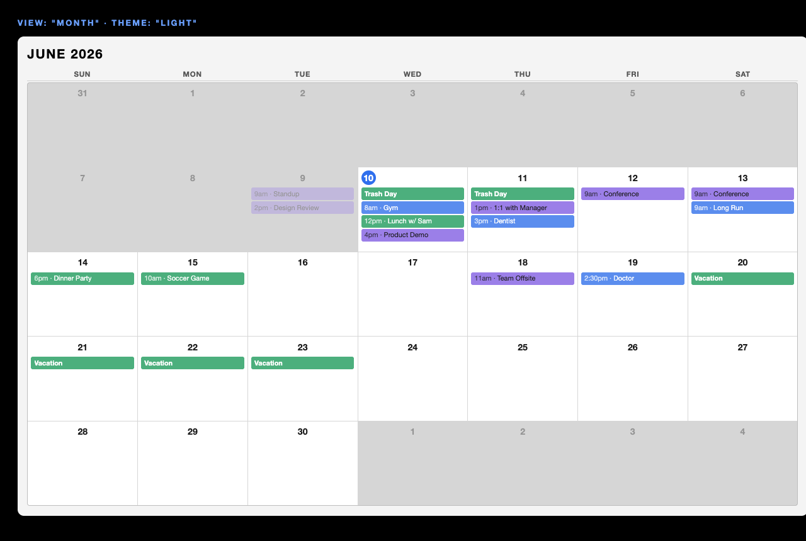
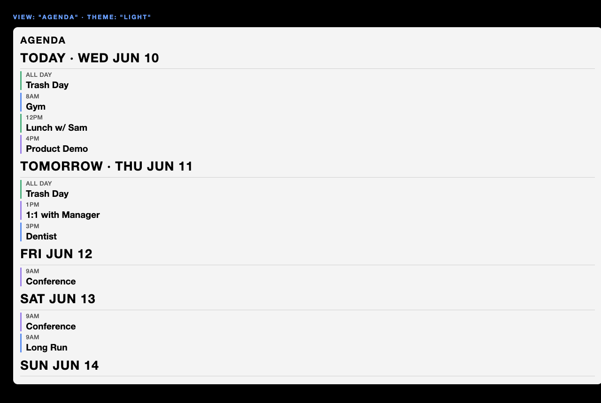

# MMM-CalendarGrid

A MagicMirror² module that displays a full-month calendar grid with colored event pills, plus a companion `MMM-TodayEvents` sidebar showing today's agenda in large text.

Built for full CSS control and responsiveness — works on any screen size without configuration changes.

## Features

- **Multiple view modes** — `month`, `week`, `3day` (yesterday/today/tomorrow cards), `agenda` (next N days), and `2week`, with optional auto-rotation between them
- Month grid with solid, color-filled event pills (text auto-contrasts black/white for legibility)
- Per-calendar color coding
- **Light and dark themes** via a single `theme` option, with all colors exposed as overridable CSS variables
- All-day and timed events
- Multi-day events shown as repeated pills in each spanned day
- Static "+ X more" overflow label when a day exceeds `maxEventsPerDay`
- Today's date highlighted
- Other-month padding days dimmed
- `MMM-TodayEvents` sidebar reads the same data feed — no double ICS config
- Fully responsive via CSS `clamp()` and `fr` units — no JS resize logic

---

## File Structure

```
MMM-CalendarGrid/
  MMM-CalendarGrid.js     ← MM2 frontend module: builds the month grid DOM
  MMM-CalendarGrid.css    ← Responsive grid + pill styles
  MMM-TodayEvents.js      ← MM2 frontend module: today's events sidebar
  MMM-TodayEvents.css     ← Sidebar styles
  node_helper.js          ← Node backend: fetches + parses ICS feeds, broadcasts events
  package.json            ← npm dep: node-ical
```

### How the two modules share data

`node_helper.js` fetches all configured ICS feeds and broadcasts a single `CALENDAR_EVENTS` socket notification containing a flat array of normalized event objects. Both `MMM-CalendarGrid.js` and `MMM-TodayEvents.js` listen for this notification independently — there is no second fetch, and `MMM-TodayEvents` has no node_helper of its own.

**`MMM-TodayEvents` will not receive data unless `MMM-CalendarGrid` is also active in `config.js`**, since the node_helper lives in the CalendarGrid module folder.

---

## Install

```bash
cd ~/MagicMirror/modules
git clone https://github.com/joeycozza/MMM-CalendarGrid
cd MMM-CalendarGrid
npm install
```

---

## MagicMirror Config

Add **both** entries to `~/MagicMirror/config/config.js` inside the `modules: []` array.

```js
{
  module: "MMM-CalendarGrid",
  position: "bottom_bar",   // adjust to your layout — fills the full region width
  config: {
    calendars: [
      {
        url: "https://calendar.google.com/calendar/ical/yourfeed/basic.ics",
        color: "#4caf7d",
        name: "Family",
      },
      {
        url: "https://calendar.google.com/calendar/ical/yourfeed2/basic.ics",
        color: "#9b7fe8",
        name: "Work",
      },
    ],
    theme: "dark",                    // "dark" or "light"
    updateInterval: 30 * 60 * 1000,  // 30 minutes in ms
    maxEventsPerDay: 5,               // shows "+X more" beyond this
    startOnMonday: false,             // true for Mon–Sun week layout
    showOtherMonthDays: true,         // show dimmed prev/next month filler days

    // View mode — see "View Modes" below (default is "month"; this example rotates)
    view: "rotate",                   // "month"|"week"|"3day"|"5day"|"agenda"|"2week"|"rotate"
    rotateViews: ["week", "3day", "agenda"], // cycled when view: "rotate"
    rotateInterval: 20 * 1000,        // ms each view stays on screen
    agendaDays: 7,                    // days shown in the agenda view
    maxEventsAgenda: 50,              // total event cap in the agenda view
  },
},
{
  module: "MMM-TodayEvents",
  position: "top_right",
  config: {
    title: "TODAY",     // header label
    maxEvents: 10,      // max events to list
    theme: "dark",      // match MMM-CalendarGrid's theme
  },
},
```

---

## Config Reference

### MMM-CalendarGrid

| Option | Type | Default | Description |
|---|---|---|---|
| `calendars` | Array | `[]` | Array of `{ url, color, name }` objects. `url` is a valid iCal/ICS URL. `color` is any CSS hex color. `name` is a display label. |
| `theme` | String | `"dark"` | Color theme: `"dark"` (light text on the mirror's black background) or `"light"` (near-white day cells with dark text). See [CSS Customization](#css-customization) to fine-tune either theme. |
| `updateInterval` | Number | `1800000` | How often to re-fetch feeds, in ms. Default is 30 minutes. |
| `maxEventsPerDay` | Number | `5` | Max events shown per day before a "+ X more" label. Applies to `month`, `week`, `2week` day cells and the `3day` cards. (The `agenda` view uses `maxEventsAgenda` instead.) |
| `startOnMonday` | Boolean | `false` | `true` = week starts Monday. `false` = week starts Sunday. Affects `month`, `week`, and `2week` views. |
| `showOtherMonthDays` | Boolean | `true` | Whether to show dimmed padding days from the previous and next month (month view only). |
| `view` | String | `"month"` | Which view to render: `"month"`, `"week"`, `"3day"`, `"5day"`, `"agenda"`, `"2week"`, or `"rotate"`. See [View Modes](#view-modes). |
| `rotateViews` | Array | `["week", "3day", "agenda"]` | List of views to cycle through when `view: "rotate"`. Any of `"month"`, `"week"`, `"3day"`, `"5day"`, `"agenda"`, `"2week"`. Needs at least 2 entries (otherwise rotation is skipped). |
| `rotateInterval` | Number | `20000` | How long each view stays on screen during rotation, in ms. |
| `agendaDays` | Number | `7` | Number of days (starting today) the `agenda` view scans for events. |
| `maxEventsAgenda` | Number | `50` | Maximum total events listed across all days in the `agenda` view. |

### MMM-TodayEvents

| Option | Type | Default | Description |
|---|---|---|---|
| `title` | String | `"TODAY"` | Header label displayed above the event list. |
| `maxEvents` | Number | `10` | Maximum number of today's events to display. |
| `theme` | String | `"dark"` | Color theme: `"dark"` or `"light"`. Match this to the `MMM-CalendarGrid` `theme` for a consistent look. |

---

## View Modes

Set `view` to control how the calendar is rendered. All views read the same event
feed — switching is purely a layout change.

| `view` | What it shows |
|---|---|
| `"month"` | The full-month grid (the original layout). |
| `"week"` | The current week as a single row of 7 tall columns — much more readable per day. Honors `startOnMonday`. |
| `"3day"` | Three large cards: **Yesterday**, **Today**, **Tomorrow**, each listing that day's events in large text. Today is highlighted; yesterday is dimmed. |
| `"5day"` | Like `3day` but five cards: **Yesterday** through three days out (yesterday, today, tomorrow, +2, +3). Today highlighted; yesterday dimmed. |
| `"agenda"` | A vertical chronological list of the next `agendaDays` days, grouped by day, in large text. Days with no events are skipped. |
| `"2week"` | This week plus next week — two rows of 7. A middle ground between week and month. |
| `"rotate"` | Cycles through the views listed in `rotateViews`, switching every `rotateInterval` ms. |

### What each view looks like

> Previews rendered at 1280×860 with sample events. On your mirror the `clamp()`
> font sizing and panel dimensions will scale to the region you place the module in.

**`month`** — the full grid; today highlighted, past days dimmed, multi-day events span their cells.



**`week`** — the current week as one tall row of 7 (header shows the date range).



**`3day`** — Yesterday / Today / Tomorrow as large cards with big time + title rows.



**`5day`** — five day cards (yesterday through +3), same big-card style as `3day`.



**`agenda`** — chronological list grouped by day, empty days skipped.



**`2week`** — this week plus next week, two rows of 7.



**Rotation example** — cycle week → 3day → agenda, 20 seconds each:

```js
config: {
  view: "rotate",
  rotateViews: ["week", "3day", "agenda"],
  rotateInterval: 20 * 1000,
  calendars: [ /* ... */ ],
}
```

You can also run two `MMM-CalendarGrid` instances in different positions with
different fixed `view` values (e.g. a `month` overview plus a `3day` close-up).

> **Note:** the backend fetches a 3-month window (previous → next month), so an
> `agendaDays` value that reaches beyond the end of next month may show empty
> tail days. The default (`7`) is always covered.

---

## Themes

Set `theme` to `"dark"` (default) or `"light"`. Events are rendered as **solid color-filled pills** with the text color auto-picked (black or white) for the best contrast against each calendar's color — so they stay legible in either theme. The light theme draws a self-contained light panel so it reads cleanly even on the mirror's black background.

> The previews above use the **dark** theme. The same `month` view in **light**:

| Dark | Light |
|---|---|
|  |  |

The `agenda` view in the light theme:



To match the look across both modules, set the same `theme` on `MMM-CalendarGrid` and `MMM-TodayEvents`. Individual colors are tunable via CSS variables — see below.

---

## CSS Customization

All styles are in `MMM-CalendarGrid.css` and `MMM-TodayEvents.css`. Font sizes use `clamp(min, preferred, max)` so they scale automatically — adjust the values to tune for your screen size.

### Key CSS classes

**MMM-CalendarGrid:**

| Class | What it styles |
|---|---|
| `.mmm-cg-wrapper` | Outer module container |
| `.mmm-cg-header` | Title row — month/year ("June 2026"), week range ("Jun 7 – 13"), or "Agenda" depending on view |
| `.mmm-cg-day-label` | Day-of-week header labels (Sun, Mon, …) |
| `.mmm-cg-grid` | The 7-column CSS Grid container |
| `.mmm-cg-cell` | Individual day cell |
| `.mmm-cg-cell.today` | Today's cell — date number gets the blue circle |
| `.mmm-cg-cell.other-month` | Prev/next month filler cells (dimmed) |
| `.mmm-cg-date-num` | The date number inside each cell |
| `.mmm-cg-pill` | An event pill — filled solid with the calendar color (`background-color` set inline); the text `color` is set inline to black or white, whichever has better contrast against that fill |
| `.mmm-cg-pill.all-day` | All-day event pill variant |
| `.mmm-cg-pill-text` | Text inside a pill (truncated with ellipsis) |
| `.mmm-cg-pill-time` | The leading time prefix inside a timed pill (e.g. "5pm · "); slightly recessed so the title reads first |
| `.mmm-cg-more` | The "+ X more" overflow label |
| `.mmm-cg-week` / `.mmm-cg-2week` | Wrapper modifiers — set the grid row count for the week / two-week views |
| `.mmm-cg-card-grid` | The card container for the `3day` / `5day` views (3 or 5 columns) |
| `.mmm-cg-5day .mmm-cg-card-grid` | Overrides the card grid to 5 columns for the `5day` view |
| `.mmm-cg-card` (`.today` / `.past`) | A single day card in the `3day` / `5day` views |
| `.mmm-cg-card-header` | The day label inside a card (e.g. "Today · Jun 10") |
| `.mmm-cg-card-event` | A large event row — used in both `3day` cards and the `agenda` list; `border-left-color` set inline per calendar color |
| `.mmm-cg-card-time` | Time label in a large event row (or "All day") |
| `.mmm-cg-card-title` | Event title in a large event row |
| `.mmm-cg-agenda-list` | The `agenda` view list container |
| `.mmm-cg-agenda-day` | One day group in the agenda |
| `.mmm-cg-agenda-date` | The day header in the agenda (e.g. "Today · Wed Jun 10") |
| `.mmm-cg-empty` | "No upcoming events" message (agenda view) |

**MMM-TodayEvents:**

| Class | What it styles |
|---|---|
| `.mmm-te-wrapper` | Outer module container |
| `.mmm-te-header` | "TODAY" title |
| `.mmm-te-list` | Event list container |
| `.mmm-te-event` | Individual event row — `border-left-color` set inline per calendar color |
| `.mmm-te-time` | Time label (e.g. "9am") |
| `.mmm-te-title` | Event title in large text |
| `.mmm-te-empty` | "No events today" message |

### Theme color variables

Both themes are defined as CSS custom properties on the wrapper, so you can override any single color without touching the rest. The `theme` config option selects which set is active (`.mmm-cg-theme-dark` / `.mmm-cg-theme-light` on `MMM-CalendarGrid`, `.mmm-te-theme-dark` / `.mmm-te-theme-light` on `MMM-TodayEvents`). To tweak, add a rule in your own CSS, e.g.:

```css
/* Warmer "today" highlight in the dark theme */
.mmm-cg-wrapper.mmm-cg-theme-dark { --cg-today-bg: #e0663b; }
```

| Variable (MMM-CalendarGrid) | Role |
|---|---|
| `--cg-surface` | Whole-module panel background (transparent in dark; light card in light theme) |
| `--cg-text` | Base text color (date numbers, body) |
| `--cg-text-strong` | Headers and titles |
| `--cg-text-muted` | Day-of-week labels, time labels |
| `--cg-text-faint` | "+ X more" overflow label |
| `--cg-cell-bg` | Day-cell / card background |
| `--cg-grid-line` | Grid gap lines and border |
| `--cg-divider` | Header / section underlines |
| `--cg-today-bg` / `--cg-today-text` | Today's date-number circle |
| `--cg-today-card-bg` | Today's card tint (3day / 5day) |
| `--cg-card-default-bar` | Fallback left bar when an event has no color |

`MMM-TodayEvents` exposes the parallel `--te-surface`, `--te-text`, `--te-text-strong`, `--te-text-muted`, `--te-divider`, and `--te-default-bar`.

> **Note:** event-pill fills come from each calendar's `color`, not from these variables, and pill text is auto-contrasted (black/white) against that fill — so pills stay readable in either theme.

---

## Event Object Schema

The node_helper broadcasts an array of event objects with this shape:

```js
{
  id: String,           // unique identifier (uid or generated)
  title: String,        // event summary
  start: String,        // ISO 8601 datetime string
  end: String,          // ISO 8601 datetime string
  allDay: Boolean,      // true if no specific time
  color: String,        // hex color from calendar config
  calendarName: String, // name from calendar config
}
```

---

## Troubleshooting

**Module not found / not loading**
- Confirm the folder is named exactly `MMM-CalendarGrid` inside `~/MagicMirror/modules/`
- Run `npm install` inside the module folder
- Check MM2 logs: `cd ~/MagicMirror && npm start` — errors print to the terminal

**No events showing**
- Verify your ICS URL is publicly accessible (test it in a browser — it should download a `.ics` file)
- Check the MM2 console for `[MMM-CalendarGrid] Failed to fetch` errors
- Google Calendar: make sure the calendar is shared as "public" and you're using the **ICS** link (not the HTML link)

**MMM-TodayEvents shows nothing**
- Confirm `MMM-CalendarGrid` is also in your `config.js` and loaded — it owns the node_helper that broadcasts data
- Both modules must be in the same folder (`MMM-CalendarGrid/`)

**Updating**
```bash
cd ~/MagicMirror/modules/MMM-CalendarGrid
git pull
npm install
```
